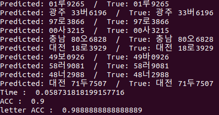
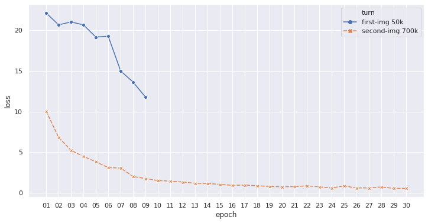
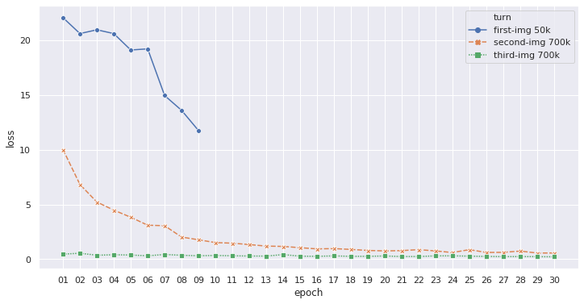
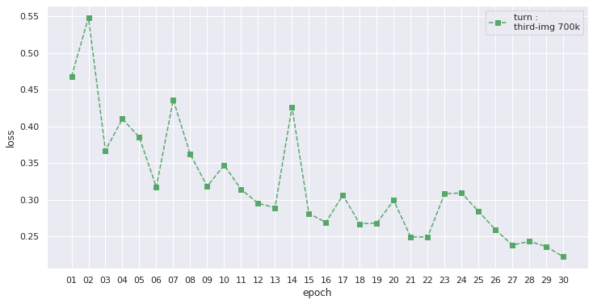
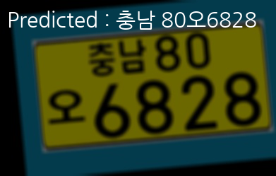
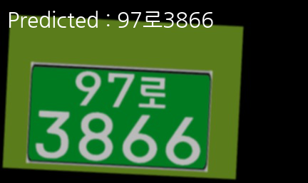
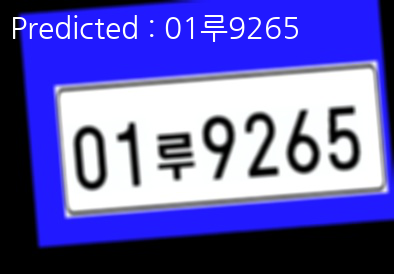

# License_plate_recognition_CRNN_korean

### 한국어 번호판 인식 모델 만들기

이 레포를 사용했습니다! 대단하신분.. 감사해요 
[CRNN_Keras](https://github.com/qjadud1994/CRNN-Keras)

### process
1. 번호판 Generator 코드를 이용해 약 700,000장 생성
2. 서버가 따라주는 한에서 최대한 훈련, 목표는 Accuracy 0.9
3. Tensorflow Extended(TFX)로 파이프라인 구축 + loss 0.1 이하 달성, 모델 경량화 예정
4. 목표는 Tensorflow Lite로 배포해서 실시간성 앱에 탑재

---------------------------------------------------

### first turn

테스트로 돌려본 후(~epoch 09까지) 데이터 늘려서 best model로 이어서 학습.

| train data | validation data | stop epoch | best val loss |
| :----------: | :----------------: | :------: | :------: |
50,000 | 5,000 | 09 | 11.773 |

### second turn

| train data | validation data | stop epoch | best val loss |
| :----------: | :----------------: | :------: | :------: |
700,000 | 79,000 | 30 | 0.571 |

### third turn

| train data | validation data | stop epoch | best val loss |
| :----------: | :----------------: | :------: | :------: |
700,000 | 79,000 | 30 | 0.222 |

>third turn only

-----------------------------------------------------------

### performance

|test img | Time | Accuracy | letter Accuracy |
|:----: | :----: | :----: | :-----: |
| 10 | 0.042 | 0.9 | 0.988 |

**Ground Truth vs Predicted**

| Ground Truth | Predicted |
| :-------: | :-------: |
|  01루9265 |  01루9265 |
| 광주 33버6196 | 광주 33버6196 |
| 97로3866 | 97로3866 |
| 00사3215 | 00사3215 |
| 49보0926 | 49바0926 |
| 대전 71두7507 | 대전 71두7507 |

-----------------------------------------------------------

### predict sample

간단하게 예측한 결과만 이미지에 표시되로록 함.
한글 출력을 위해 Prediction.py에서 cv부분만 pillow 코드로 수정.

-------------------------------------------------------------

### Train

~~~
python3 training.py
~~~

### predict

~~~
python3 Predict.py
~~~

### Setting
여러 버전 관리 및 삽질 끝에 찾아낸 가장 적절한 세팅..

* Docker : nvidia/cuda:10.0-cudnn7-runtime-ubuntu18.04
* python : 3.6
* Tensorflow-gpu : 1.13.1
* Keras : 2.2.4

 
